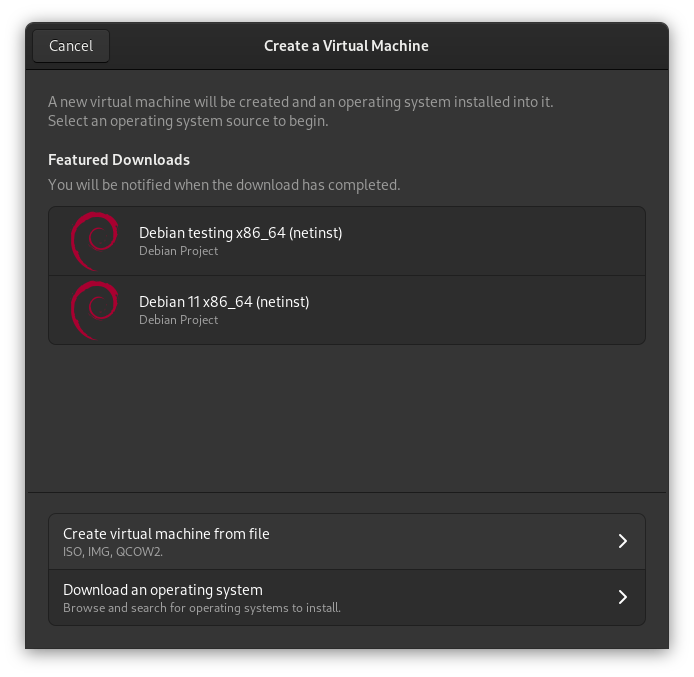
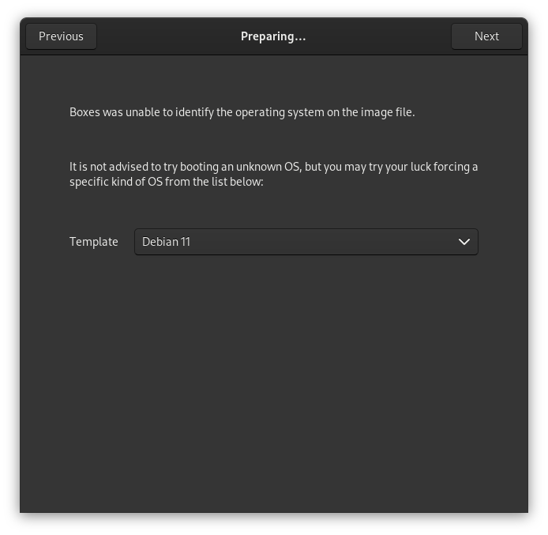
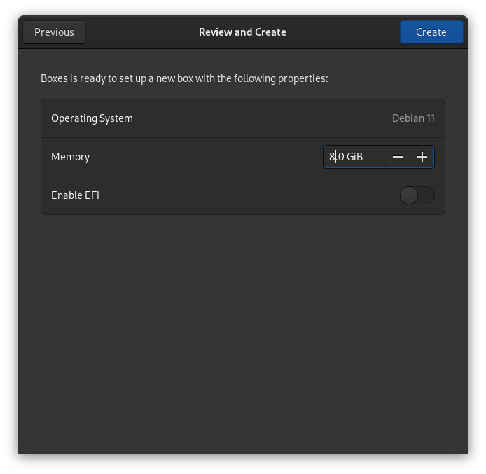

# QEMU (CLI)
Example using 8GB of RAM and 8 CPU cores:
```sh
$ qemu-system-x86_64 -m 8096 -enable-kvm -smp 8 -netdev user,id=mynet.0,hostfwd=tcp::18000-:18000 -device virtio-net-pci,netdev=mynet.0 -hda devstack-bullseye.qcow2
```

# GNOME Boxes
## Create the VM in Boxes
### Create a new VM from file


### Select Debian 11 as the OS


### Select 8+ GB of ram, create VM


## Set up port forwarding
### Find your VM with `virsh`

`virsh list` or `virsh -c qemu:///session list --all`

find the name of the devstack vm, mine was `debian11`

```bash
$ virsh list
 Id   Name       State
--------------------------
 3    debian11   running

$ virsh -c qemu:///session list --all
 Id   Name            State
--------------------------------
 3    debian11        running
```

### Edit your VM config using `virsh`

```
$ virsh edit debian11
```

remove the `user` interface block `<interface type='user'>`

add qemu namespace to root tag
```xml
<domain type='kvm'>
```
to
```xml
<domain type='kvm' xmlns:qemu='http://libvirt.org/schemas/domain/qemu/1.0'>
```
add command line stuff to the end
```xml
  <qemu:commandline>
    <qemu:arg value='-netdev'/>
    <qemu:arg value='user,id=mynet.0,net=10.0.10.0/24,hostfwd=tcp::18000-:18000'/>
    <qemu:arg value='-device'/>
    <qemu:arg value='virtio-net-pci,netdev=mynet.0,bus=pcie.0,addr=0x3'/>
  </qemu:commandline>
```

# `virt-manager`


# todo
finish port forwarding instructions, for now, based on https://unix.stackexchange.com/a/519067

